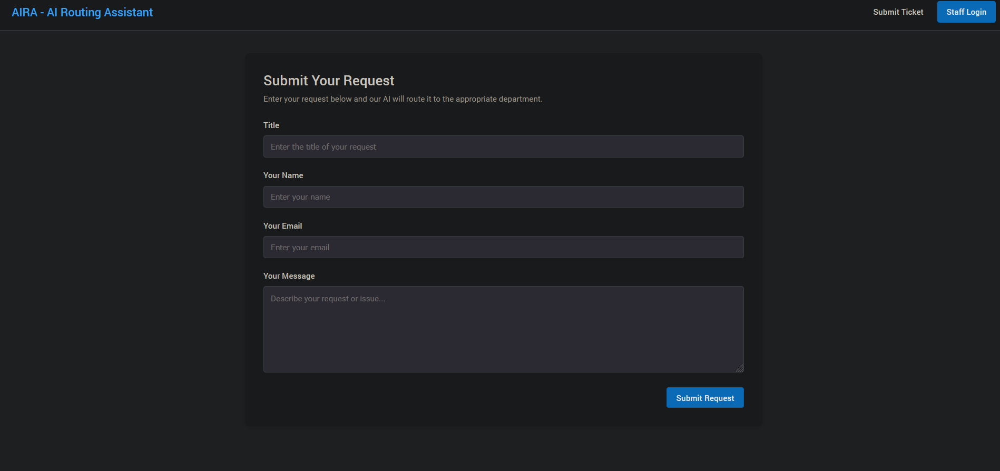
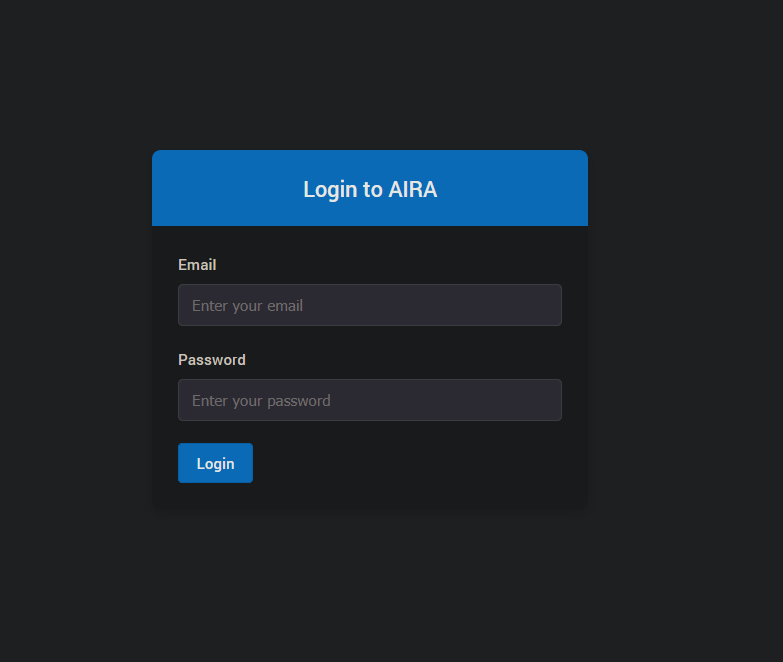
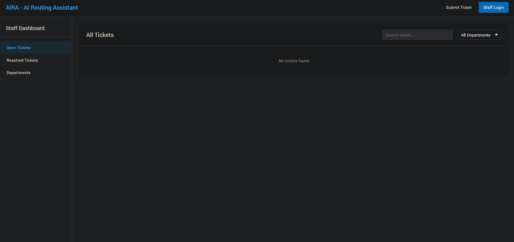

# AIRA-Balagh (AI Routing Assistant for Saudi Arabia)

AIRA-Balagh is a localized smart routing platform designed for Saudi Arabia to simplify issue reporting for citizens. Whether it's public infrastructure problems, restaurant complaints, or accidents, AIRA-Balagh uses advanced AI to analyze submitted messages (tickets), classify them, and forward them to the appropriate authority for resolution. It ensures efficient communication and faster solutions by connecting citizens with the right departments or organizations.

## Key Features

### Universal Issue Reporting
Citizens can submit complaints via text, images, or voice, allowing flexibility in how issues are reported.

### Intelligent Routing
Using classification methods, AIRA-Balagh identifies the nature of the issue and determines the correct department or organization to handle it.

### Multimodal Input
AIRA-Balagh supports text, image, and voice analysis to provide rich context for each ticket.

### Real-Time Dashboard
Authorities can view and manage tickets through an intuitive dashboard, enabling faster responses and better tracking of resolutions.

---

## Form Validation

HTML form validation is implemented in the Login component to ensure user inputs are correctly formatted and secured.

### login.jsx

```jsx
<input
  id="email"
  type="email"
  value={email}
  onChange={(e) => setEmail(e.target.value)}
  required
  className="form-input"
  placeholder="Enter your email"
/>
```

### Email Type Validation

The input field uses type="email" for built-in format validation:

```jsx
<input
  id="email"
  type="email"
  ...
/>
```

### Form Submission Handling

The submission handler ensures proper validation and error handling:

```jsx
const handleSubmit = async (e) => {
  e.preventDefault();
  setError('');
  setIsLoading(true);

  try {
    await login(email, password);
    navigate('/dashboard');
  } catch (err) {
    setError(err.message); 
    console.error('Login error:', err);
  } finally {
    setIsLoading(false);
  }
};
```

---

## User Interface

### Ticket Submission


### Staff Login Screen


### Staff Dashboard
